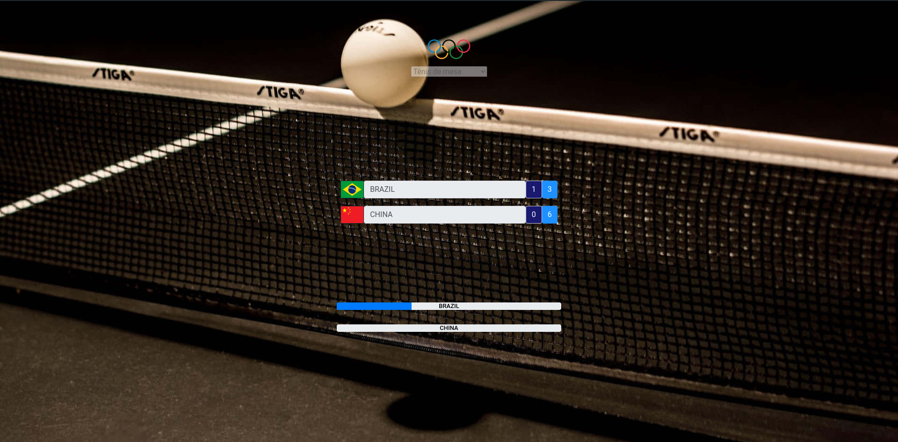
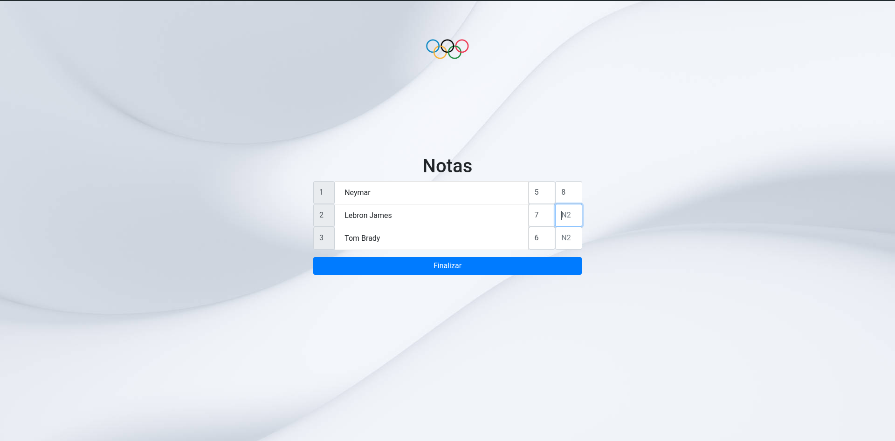

# Placar Olímpico

Este projeto possui dois sistemas distintos: o **Sistema de Placar** e o **Sistema de Notas**. Ambos são desenvolvidos utilizando **Vue.js** e **Bootstrap**, e oferecem funcionalidades interativas para registrar resultados de competições e classificar participantes.

---

## Sistema de Placar

Inspirado nas Olimpíadas, este sistema de controle de placar interativo permite registrar e exibir o desempenho de dois países em competições de esportes olímpicos, como vôlei, vôlei de praia e tênis de mesa. 

### Funcionalidades

- **Seleção de Esporte**: O usuário pode escolher entre diferentes esportes olímpicos:
  - Vôlei (pontos limite de 25)
  - Vôlei de praia (pontos limite de 21)
  - Tênis de mesa (pontos limite de 11)
  
- **Cadastro de Países**: O sistema permite que o usuário insira os países participantes (País 1 e País 2). As bandeiras dos países serão automaticamente exibidas após o cadastro, e o placar do jogo será atualizado conforme o jogo avançar.

- **Controle de Pontos e Sets**: O sistema permite que os pontos sejam aumentados para cada time, e cada vez que um time atinge o número limite de pontos para um set, o set é finalizado. O sistema permite até 3 sets por partida.

- **Exibição do Vencedor**: Ao atingir 3 sets ganhados, o jogo termina, e o vencedor é exibido com o resultado do jogo (quantos sets foram ganhados por cada time).

- **Mudança de Fundo**: O fundo da página é alterado automaticamente dependendo do esporte selecionado.

### Passos para Utilização

1. **Selecione o Esporte**: No menu suspenso, escolha o esporte desejado.
2. **Cadastre os Países**: Preencha o nome do País 1 e do País 2 e clique no botão **Cadastrar países**. As bandeiras dos países serão exibidas automaticamente.
3. **Registre os Pontos**: Clique nos botões de pontos para aumentar a pontuação dos países. O placar será atualizado em tempo real.
4. **Final do Jogo**: O jogo terminará quando um dos times alcançar 3 sets. O vencedor será exibido com o resultado final.
5. **Alterações de Esporte**: Ao alterar o esporte, o fundo da página será alterado automaticamente de acordo com o esporte escolhido.

---

## Sistema de Notas

Este projeto é uma aplicação interativa de notas e placar para participantes, permitindo registrar e ordenar as notas de múltiplos participantes, visualizando o vencedor ao final com base nas notas inseridas.

### Funcionalidades

- **Cadastro de Participantes**: 
   - O usuário pode adicionar participantes à lista.
   - Cada participante tem dois campos para notas (N1 e N2).

- **Ordenação por Notas**: 
   - As notas são automaticamente ordenadas, com o maior valor sendo priorizado.

- **Finalização e Exibição de Resultados**:
   - Após adicionar pelo menos 3 participantes, o botão "Finalizar" se torna disponível.
   - O sistema exibe a classificação final (1º, 2º e 3º lugar) com medalhas de ouro, prata e bronze.

### Passos para Utilização

1. **Adicionar Participantes**: No campo de texto, insira o nome do participante e pressione **Enter** ou clique em **Adicionar** para adicionar um novo participante.
2. **Cadastrar Participantes**: Quando pelo menos 3 participantes forem cadastrados, clique em **Cadastrar Participantes** para liberar o campo de notas.
3. **Registrar Notas**: Para cada participante, insira as notas nos campos **N1** e **N2**.
4. **Finalizar e Exibir Resultados**: Clique no botão **Finalizar** quando todos os participantes tiverem suas notas inseridas. O sistema exibirá a classificação final com os 3 primeiros lugares, com medalhas de ouro, prata e bronze.

---

## Estrutura do Código

### Frontend (HTML, CSS e Vue.js)
- O código HTML define a estrutura básica da interface, incluindo os campos de entrada, botões e progresso de pontuação.
- O Vue.js é usado para gerenciar o estado da aplicação, incluindo o controle de pontos, sets, e seleção de esportes.
- O Bootstrap é utilizado para garantir que a interface seja responsiva e visualmente agradável.

### Estilos Personalizados
- O arquivo CSS e estilos inline são usados para definir a aparência do fundo e a exibição de informações como o nome dos países, bandeiras, e as mensagens de vitória.

### Interação com API Externa
- A API `https://restcountries.com` é utilizada para buscar o nome e as bandeiras dos países quando o usuário preenche os campos com os nomes dos países.

---

## Tecnologias Utilizadas

- **Vue.js**
- **Bootstrap**
- **Fetch API**
- **CSS**

---
